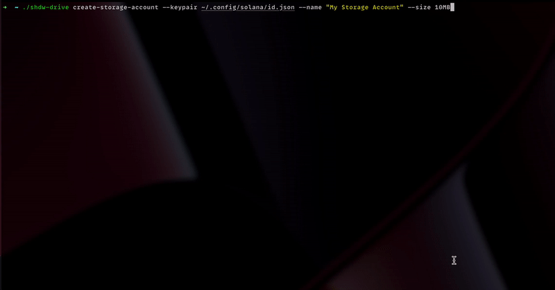
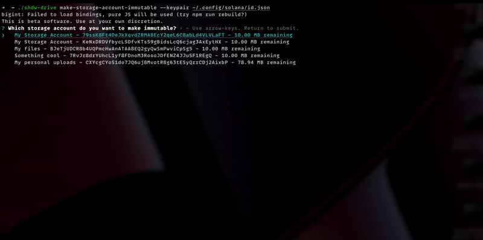
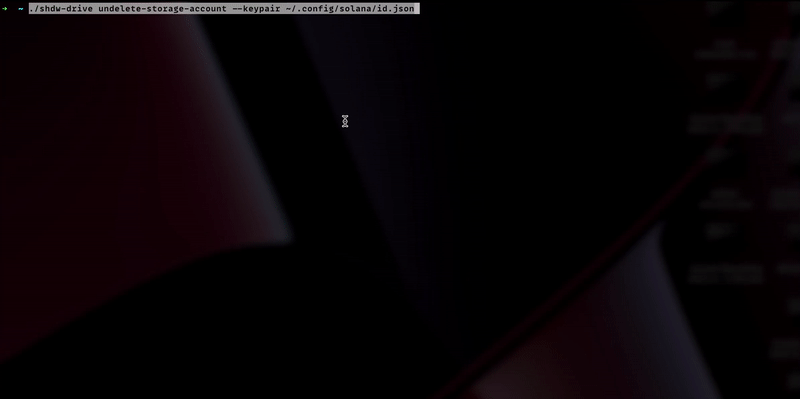
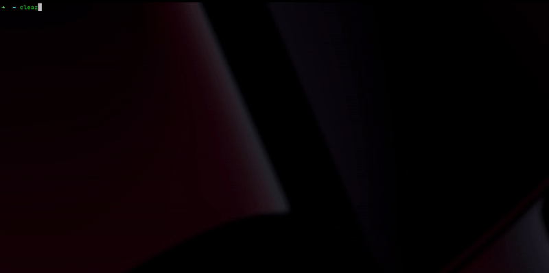
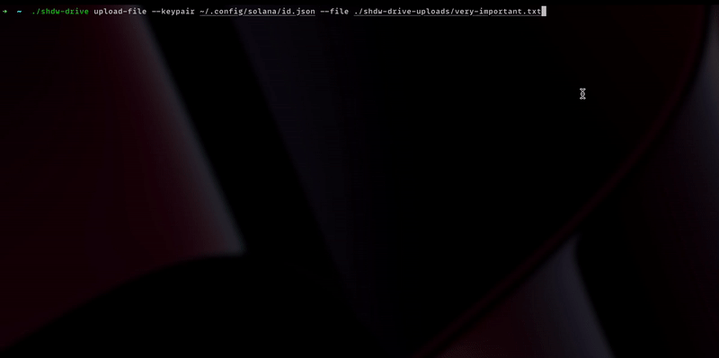
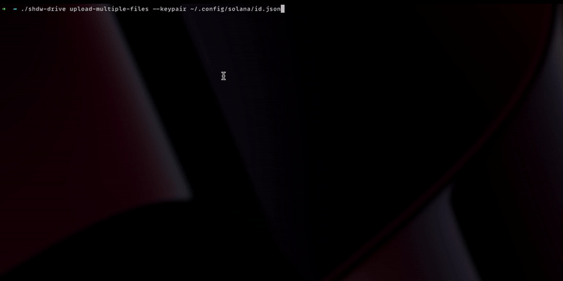
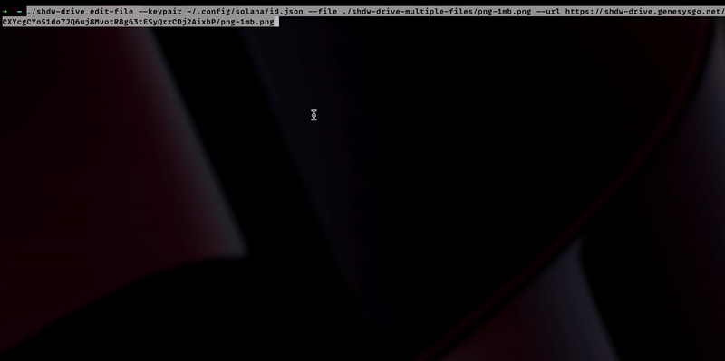

# Shadow Drive CLI

Using Shadow Drive through the CLI is as easy as (1) creating your storage account, (2) uploading a file, and (3) getting your finalized file URL back after uploading.

## Installation

You can install the Shadow Drive CLI by downloading one of the files below that matches your system's architecture:


BINARIES BELOW ARE OUT OF DATE! As soon as the smart contract has finished deploying on Solana we will update!


1.  Linux x64

    `curl https://shdw-drive.genesysgo.net/HxUAdsVaibQPU9YSqq4vJV1uJGN3LDeoW4949GbhX1M/shdw-drive-linux-x64.tar.bz2 -o shdw-drive-linux-x64.tar.bz2 && tar -xvf shdw-drive-linux-x64.tar.bz2`
2.  Linux ARM

    `curl https://shdw-drive.genesysgo.net/HxUAdsVaibQPU9YSqq4vJV1uJGN3LDeoW4949GbhX1M/shdw-drive-linux-arm64.tar.bz2 -o shdw-drive-linux-arm64.tar.bz2 && tar -xvf shdw-drive-linux-arm64.tar.bz2`
3.  MacOS x64

    `curl https://shdw-drive.genesysgo.net/HxUAdsVaibQPU9YSqq4vJV1uJGN3LDeoW4949GbhX1M/shdw-drive-macos-x64.tar.bz2 -o shdw-drive-macos-x64.tar.bz2 && tar -xvf shdw-drive-linux-x64.tar.bz2`
4.  MacOS ARM

    `curl https://shdw-drive.genesysgo.net/HxUAdsVaibQPU9YSqq4vJV1uJGN3LDeoW4949GbhX1M/shdw-drive-macos-arm64.tar.bz2 -o shdw-drive-macos-arm64.tar.bz2 && tar -xvf shdw-drive-linux-arm64.tar.bz2`

After downloading the CLI executable binary, you can run it with `./shdw-drive` or you can add it to your shell's PATH by moving it into a directory that is either already exported to your PATH (like `/usr/bin`) or move it to a directory like `~/bin/shdw-drive` and run `export PATH=$PATH:~/bin/shdw-drive` to add it to your current session's PATH.

For more information on how to add an executable binary to your path permanently, please see here:

1. Linux: [https://stackoverflow.com/questions/14637979/how-to-permanently-set-path-on-linux-unix](https://stackoverflow.com/questions/14637979/how-to-permanently-set-path-on-linux-unix)
2. MacOS:
   1. [https://stackoverflow.com/questions/11530090/adding-a-new-entry-to-the-path-variable-in-zsh](https://stackoverflow.com/questions/11530090/adding-a-new-entry-to-the-path-variable-in-zsh)
   2. [https://scriptingosx.com/2017/04/about-bash\_profile-and-bashrc-on-macos/](https://scriptingosx.com/2017/04/about-bash\_profile-and-bashrc-on-macos/)

## Getting Started

The basic flow of Shadow Drive is as follows:

1. Get some [$SHDW](https://www.orca.so) in your wallet
2. Create your storage account with the [create storage account](shadow-drive-cli.md#create-storage-account) command
3. Upload your file(s) with the [upload file](shadow-drive-cli.md#upload-file) or [upload multiple files](shadow-drive-cli.md#upload-multiple-files) commands
4. Optional: Mark your storage account as immutable to permanently lock your files in place with the [make storage account immutable command](shadow-drive-cli.md#make-storage-account-immutable)
5. Congratulations, you're now storing your files on Shadow Drive!

## Command Reference

### Help

Example: `shdw-drive help`

This command will display all the available commands for the Shadow Drive CLI.

.png>)

### Create Storage Account

Example: `shdw-drive create-storage-account --keypair ~/.config/solana/id.json --name "My Storage Account" --size 10MB`

This command will create your storage account for you. You will be shown the estimated $SHDW amount required to create the storage account before continuing with submitting the transaction to Solana and the Shadow Drive Network.

Parameters:

1. Keypair: Path to wallet that will create the storage account
2. Name: What you want your storage account to be named. (Does not have to be unique)
3. Size: Amount of storage you are requesting to create. Should be in a string like '1KB', '1MB', '1GB'. Only KB, MB, and GB storage delineations are supported currently.

### Make Storage Account Immutable

Example: `shdw-drive make-storage-account-immutable --keypair ~/.config/solana/id.json`

This will permanently lock your storage account and all files within it. You will not be able to add/reduce storage on this account, delete the storage account, or edit/delete files under this storage account.

When running this command, you will be presented with a list of storage accounts that the wallet passed in, is an admin of, and has authority to make the account immutable.

The stake from the storage account that you mark as immutable will also be deducted and closed.

Parameters:

1. Keypair: Path to the wallet that is an admin of the storage account you want to make immutable.

### Delete Storage Account

Example: `shdw-drive delete-storage-account --keypair ~/.config/solana/id.json`

If the storage account you select is not marked as immutable, you can request to delete the account. Once this request has been fully processed by a crank, your storage account and all files within it will be removed from the Shadow Drive Network. Any remaining stake in your storage account will be returned to you.

You will be presented with a list of storage accounts to choose from that you'd like to undo a deletion request for.

NOTE: Once you submit this request, you will have a grace period of the rest of the current Solana Epoch to undo this request. Once Solana's clock reaches the next epoch, you will not be able to undo this request and your account will be available for a crank to fully process the deletion.

Parameters:

1. Keypair: Path to wallet that is an admin of the storage account you want to request for deletion

### Undo Storage Account Deletion Request

Example: `shdw-drive undelete-storage-account --keypair ~/.config/solana/id.json`

This will undo a storage account deletion request. When running this command, you will be presented with a list of accounts to choose from that have been requested to be deleted and are still within the grace period.

NOTE: There is a grace period between when you request for your storage account to be deleted and when it's actually deleted. Currently it is set to be within the Solana Epoch that you requested to delete your storage account. For example, if you requested to delete a storage account in Solana Epoch 306, once Solana's clock reaches epoch 307, you are no longer able to undo the deletion request and it will be available for a crank to fully process the deletion.

Parameters:

1. Keypair: Path to the wallet that is an admin of the storage account you want to undo a deletion request for

### Add Storage

Example: `shdw-drive add-storage --keypair ~/.config/solana/id.json --size 10MB`

This will add storage capacity to an existing storage account that you select when running this command. When running this command, you will be presented with a list of accounts to choose from.

Parameters:

1. Keypair: Path to the wallet that is an admin of the storage account you want to add storage capacity to.

### Reduce Storage

Example: `shdw-drive reduce-storage --keypair ~/.config/solana/id.json --size 10MB`

This will reduce the total storage capacity available for given storage account. When running this command, you will be presented with a list of accounts to choose from.

After reducing storage on a storage account, you can run `claim-stake` to recover the $SHDW back to your wallet.

Parameters:

1. Keypair: Path to the wallet that is an admin of the storage account you want to reduce storage on.

### Claim Stake

Example: `shdw-drive claim-stake --keypair ~/.config/solana/id.json`

This will claim any available stake as a result of the `reduce storage` command. You will be presented with a list of storage accounts and the amount of stake claimable to choose from.

Parameters:

1. Keypair: Path to the wallet that is an admin of the storage account you want to claim stake from.

### Upload File

Example: `shdw-drive upload-file --keypair ~/.config/solana/id.json --file ~/Documents/something-important.md`

This will upload a file at the supplied path. When uploading a file, you will be presented with a list of storage accounts to choose from and use as the account that stores your file.

Parameters:

1. Keypair: Path to the wallet that is an admin of the storage account you want to upload to
2. File: Path to the file you want to upload. This can be a relative or absolute path.

### Upload Multiple Files

Example: `shdw-drive upload-multiple-files --keypair ~/.config/solana/id.json --directory ~/Documents/my-expensive-jpgs/`

This will allow you to upload all files in a given directory. If the file already exists, the upload for that file will be skipped and you will get back the finalized Shadow Drive URL in the response. When running this command, you will be presented with a list of storage accounts to choose from, and only the ones with enough storage for the entire directory supplied will be selectable.

The log of this command will be written to a `.json` file in your current directory.

Parameters:

1. Keypair: Path to the wallet that is an admin of the storage account you want to upload
2. Directory: Path to the folder of files you want to upload.

### Edit File

Example: `shdw-drive edit-file --keypair ~/.config/solana/id.json --file ~/Documents/something-important --url https://shdw-drive.genesysgo.net/abc123def456ghi789/something-important.md`

This will replace a file that exists on Shadow Drive with the new file supplied.

NOTE: The file you are wanting to edit must be the same name of the file that already exists in your storage account. If it does not already exist on Shadow Drive, your request will fail. If the file you want to submit to Shadow Drive has a different name, you must perform a new upload request instead.

Parameters:

1. Keypair: Path to the wallet that is an admin of the storage account the file was originally uploaded to
2. File: New file you want to upload
3. URL: The Shadow Drive URL of the file that currently exists

### Delete File

Example: `shdw-drive delete-file --keypair ~/.config/solana/id.json --url https://shdw-drive.genesysgo.net/abc123def456ghi789/something-important.md`

This will submit a request to delete the file supplied.

NOTE: Once you submit this request, you will have a grace period of the rest of the current Solana Epoch to undo this request. Once Solana's clock reaches the next epoch, you will not be able to undo this request and your file will be available for a crank to fully process the deletion.

Parameters:

1. Keypair: Path to the wallet that is an admin of the storage account the file was originally uploaded to
2. URL: The Shadow Drive URL of the file you're requesting to delete

### Undelete File

Example: `shdw-drive undelete-file --keypair ~/.config/solana/id.json --url https://shdw-drive.genesysgo.net/abc123def456ghi789/something-important.md`

This will undo a deletion request for the file supplied if it's still within the grace period.

NOTE: There is a grace period between when you request for your storage account to be deleted and when it's actually deleted. Currently it is set to be within the Solana Epoch that you requested to delete your storage account. For example, if you requested to delete a storage account in Solana Epoch 306, once Solana's clock reaches epoch 307, you are no longer able to undo the deletion request and your file will be available for a crank to fully process the deletion.

Parameters:

1. Keypair: Path to the wallet that is an admin of the storage account the file was originally uploaded to
2. URL: The Shadow Drive URL of the file you're requesting to delete

### DEVNET TESTING ONLY: Request $SHDW Airdrop

Example: `shdw-drive airdrop-shdw -r FRANKC3ibsaBW1o2qRuu3kspyaV4gHBuUfZ5uq9SXsqa`

This command will request an airdrop of devnet SHDW to your wallet.

NOTE: This is only while Shadow Drive is in development testing. If you try to make this request once Shadow Drive is deployed to mainnet, you will get an error.

